# CLOWNSEC VIDEO — Native moflex/MobiClip 3D Player for the 3DS

A homebrew video player for the Nintendo 3DS that plays `.moflex` (MobiClip video +
IMA-ADPCM audio) files **natively** — decoded in portable C, no on-device FFmpeg — with
synchronized audio. It auto-detects **stereoscopic 3D** vs flat **2D** and plays each
correctly, including movies embedded inside `.cia` files.

Full speed on **New 3DS** (2D and 3D). On **Old 3DS**, 2D plays smoothly; 3D delivers twice
the frames and the decode can't sustain that in real time, so it isn't smooth there (the
player shows a note during Old-3DS 3D playback).

The decoder is a standalone port of FFmpeg's MobiClip/moflex path, verified **bit-exact
against FFmpeg on PC** before ever touching hardware.

<p align="center">
  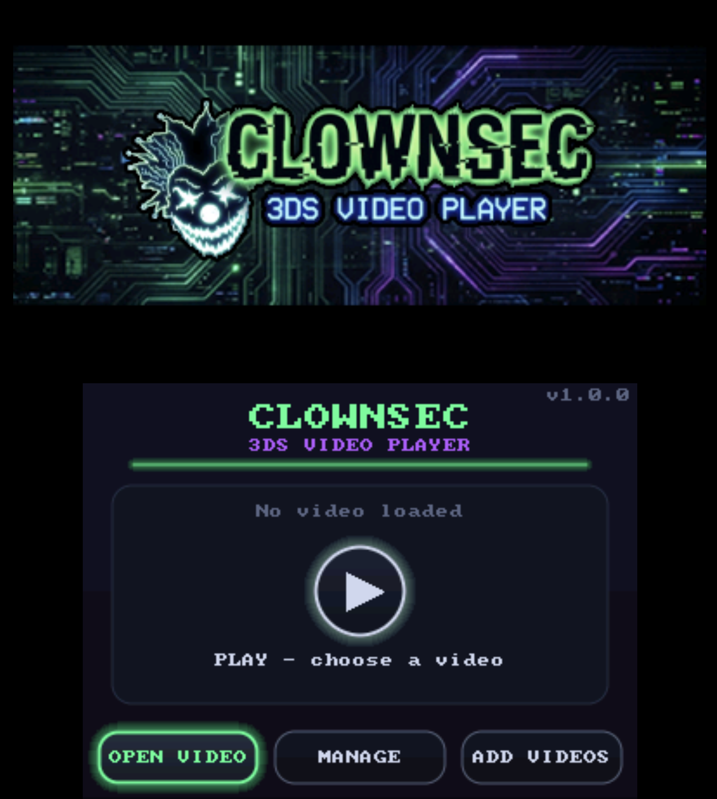
</p>

## Download

Grab the latest prebuilt binaries from the
[**Releases**](https://github.com/brainphreak/clownsec-moflex-player/releases/latest) page —
no building required:

- **`clownsec_player.3dsx`** — copy to your SD card's `/3ds/` folder and run from the
  Homebrew Launcher.
- **`clownsec_player.cia`** — install with FBI (or any CIA installer) for a HOME-menu icon.

### Testing in an emulator (Citra)

The player paces the video to the audio clock, so it needs the emulator's **DSP audio** to
actually work — otherwise the picture sits frozen at `0:00`. On real hardware this is never
an issue; it only affects emulators.

If the timer won't advance past `0:00` in Citra, give the emulator the 3DS **DSP firmware**:

1. Dump it from your own 3DS with [**DSP1**](https://github.com/zoogie/DSP1/releases) (run
   the `.3dsx`/`.cia` on the console; it writes `dspfirm.cdc` to the SD card's `/3ds/` folder).
   *(The firmware is copyrighted — dump your own; don't share the file.)*
2. Copy that `dspfirm.cdc` into the **`3ds` folder** of your emulator's virtual SD card, i.e.
   `<emulator SD>/3ds/dspfirm.cdc`. The SD-card location depends on your OS and install type:

   | OS / install | Virtual SD card path |
   |--------------|----------------------|
   | macOS | `~/Library/Application Support/Citra/sdmc/` |
   | Windows (installed) | `%APPDATA%\Citra\sdmc\` |
   | Windows (portable) | `<Citra folder>\user\sdmc\` |
   | Linux | `~/.local/share/citra-emu/sdmc/` |

   So on macOS the file goes at `~/Library/Application Support/Citra/sdmc/3ds/dspfirm.cdc`.
   (Citra forks such as Lime3DS/Azahar use their own folders — check that emulator's SD path.)
3. Restart the emulator; audio (and the video pacing) will work.

## Features

- **2D & 3D with auto-detection** — each file is detected as frame-interleaved 3D or flat 2D
  and played correctly. For 3D, the left/right eyes are paired and presented atomically so the
  two views are always the same moment (no eye desync).
- **Plays movies embedded in `.cia` files** — the moflex inside an unencrypted movie CIA is
  played in place (no extraction); when a CIA holds several movies you get a picker with their
  real titles.
- **Audio + A/V sync** via `ndsp`, audio-master pacing.
- **Responsive seeking** — a draggable seek bar (touch + D-pad), FF/RW, and hold-to-scrub.
  After a seek the landing frame is shown immediately and audio resumes synced to it.
- **Resume** — playback position is saved per movie (and per episode inside a multi-movie CIA)
  and auto-resumes where you left off.
- **Software volume boost** up to 400% for quiet sources.
- **Catalog browser** — browse the Clownsec / Zackk archives from `catalog.json`, with a
  top-screen info panel (poster art, year, runtime, genres, file size, description, and a
  3D/2D badge).
- **Downloader** — pull movies and TV seasons straight to the SD card (zips are extracted into
  their own folder), or grab any file by direct URL, with a destination-folder picker.
- **Built-in web server** — upload any files to the console from a browser over Wi-Fi.
- **File manager** — browse, move, delete, and create folders on the SD card (all files, with a
  movies-only toggle).
- **Local artwork + info** — poster and details show on the top screen for your own movies in
  Open Video, and a **Get Info** action fetches them from the catalogs for anything missing.
- **Hidden system folders** — the browser hides `3DS`, `DCIM`, `Nintendo 3DS`, etc. by default
  (press **Y** to reveal them), so you only see your movies and folders.
- **3D branding** on the top screen while idle.

## Screenshots

<table>
<tr>
<td align="center">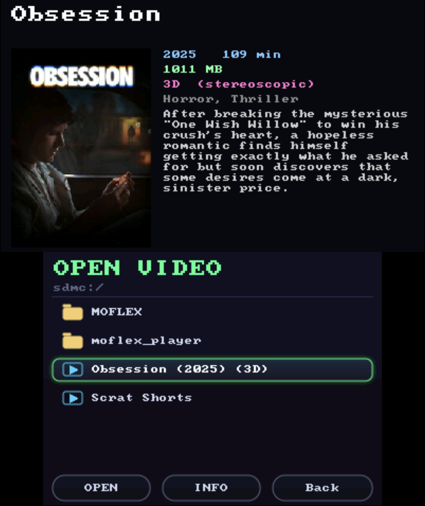<br><sub>Open Video — browse the SD card; tap to select, tap again to play</sub></td>
<td align="center">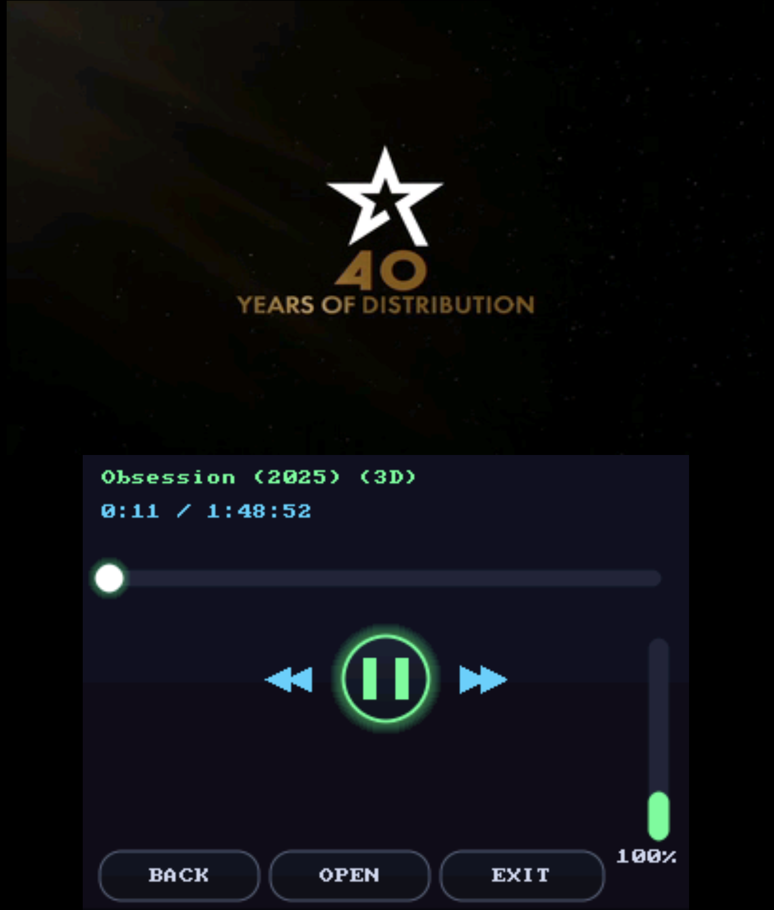<br><sub>Playback — video on the top screen, neon touch controls below</sub></td>
</tr>
<tr>
<td align="center">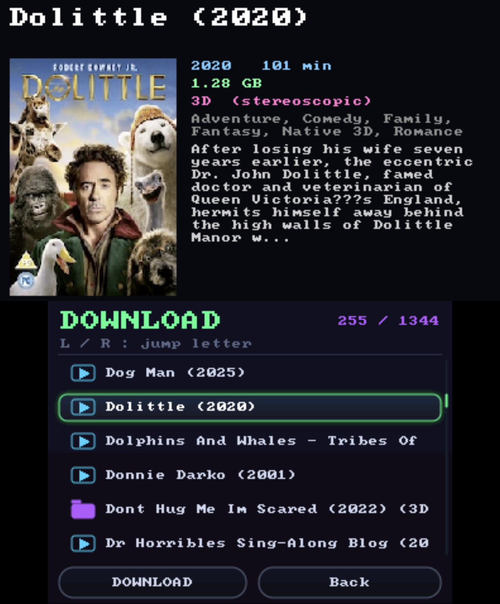<br><sub>Catalog browser — poster + details on top, download from the list</sub></td>
<td align="center">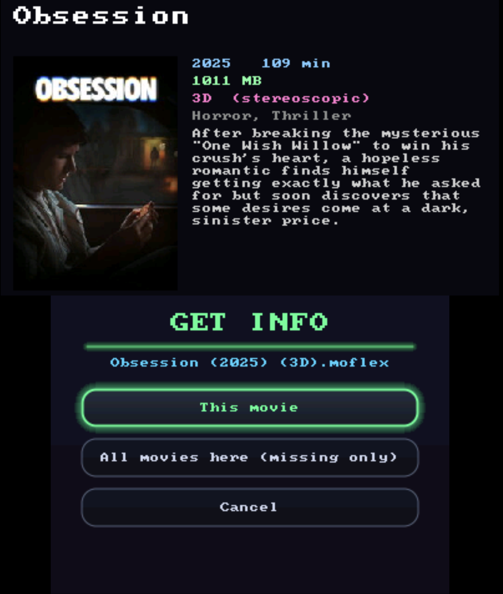<br><sub>Get Info — auto-fetch poster + details from the catalogs</sub></td>
</tr>
<tr>
<td align="center">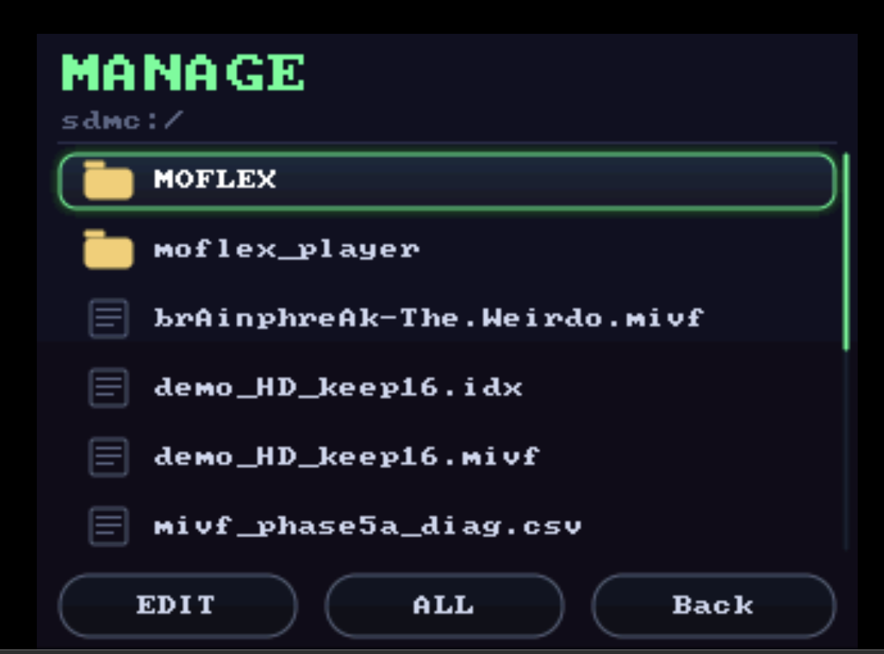<br><sub>Manage — move, delete, and organize files on the SD card</sub></td>
<td align="center">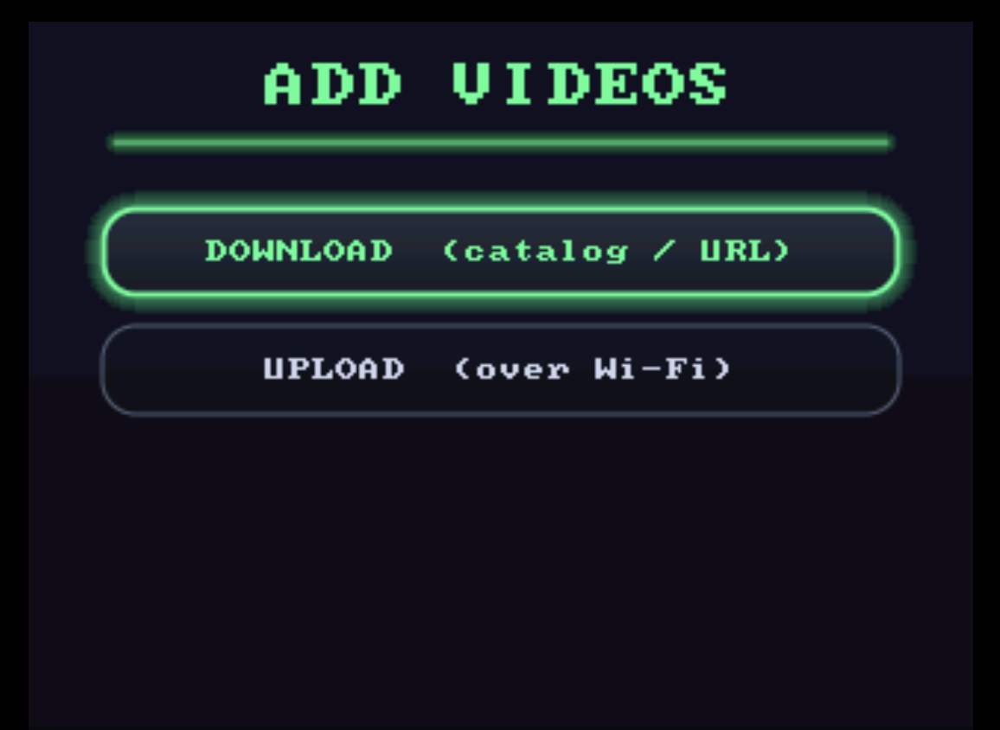<br><sub>Add Videos — download from a catalog, or upload over Wi-Fi</sub></td>
</tr>
<tr>
<td align="center">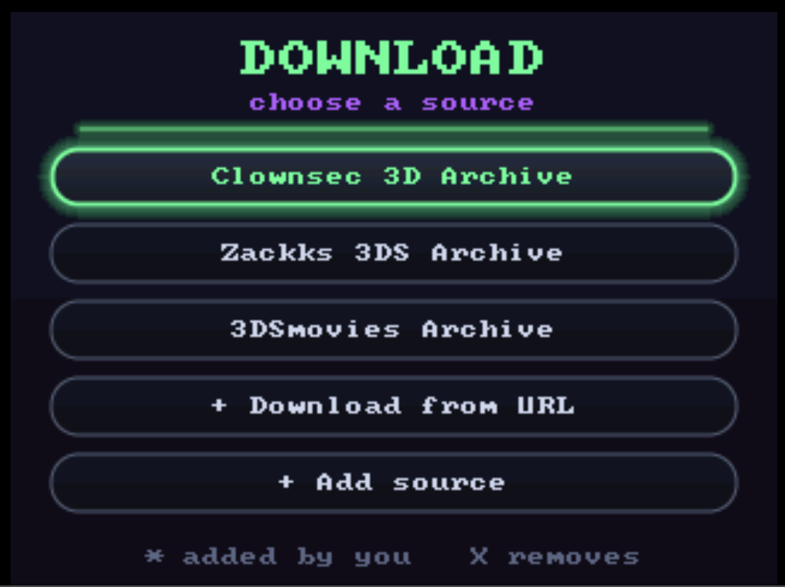<br><sub>Download — pick a catalog source (or add your own)</sub></td>
<td align="center">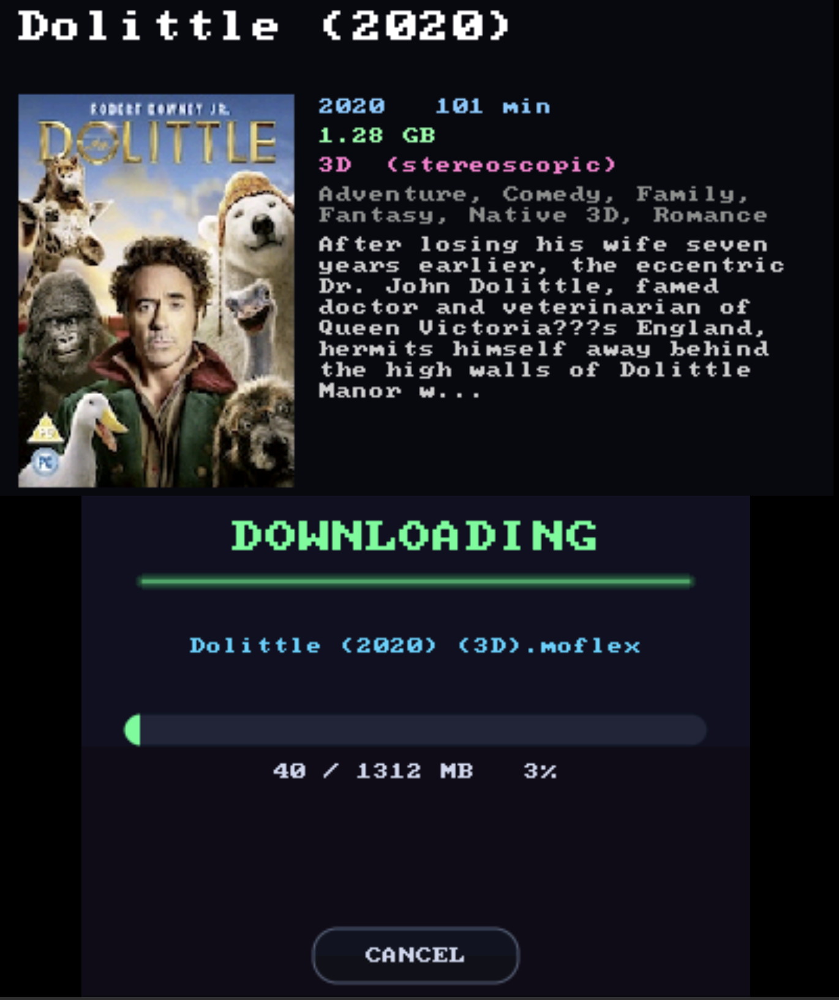<br><sub>Downloading a movie straight to the SD card</sub></td>
</tr>
<tr>
<td align="center">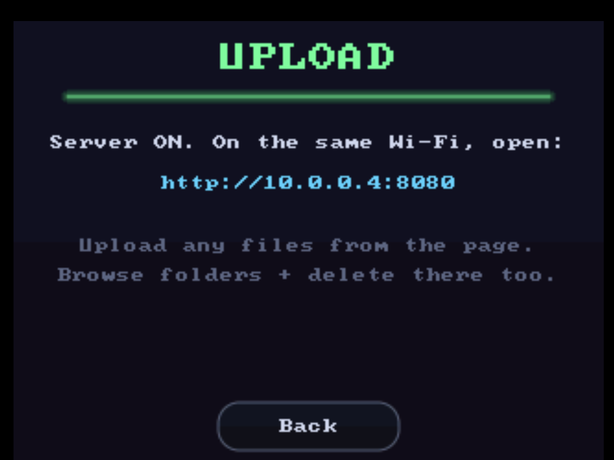<br><sub>Upload — the built-in Wi-Fi server (open the URL on a computer)</sub></td>
<td align="center">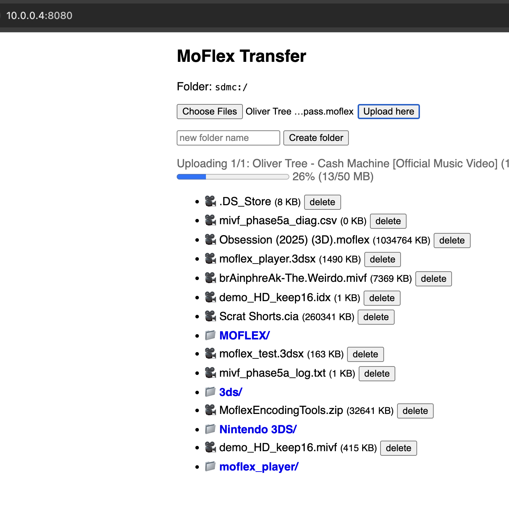<br><sub>…the upload page from your computer/phone browser</sub></td>
</tr>
<tr>
<td align="center" colspan="2">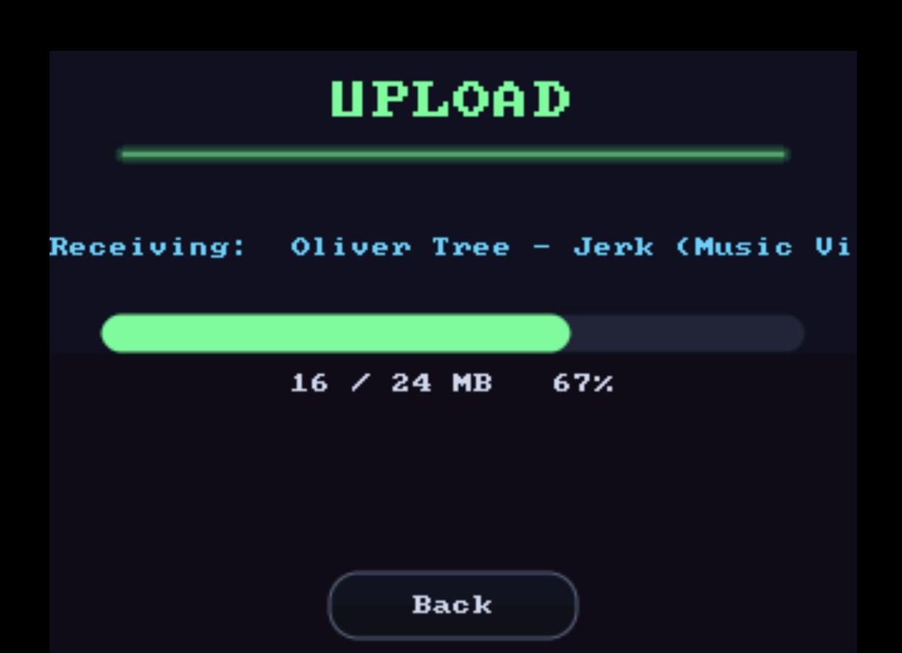<br><sub>Live upload progress on the 3DS as the file arrives</sub></td>
</tr>
</table>

## Movie info & artwork

When you highlight a movie in **Open Video**, its poster and details show on the top screen.
That metadata lives in one hidden folder, **`sdmc:/moflex_player/moviedata/`**, keyed by the
movie's filename (extension dropped) — so it works wherever the movie is on the card, and moving
the file doesn't lose its art. For `Some Movie (2001).moflex`:

- **`Some Movie (2001).nfo`** — plain text, hand-writable:
  ```
  title: Some Movie
  year: 2001
  runtime: 108
  genres: Drama, Thriller
  desc: A one-line description shown on the info panel.
  ```
- **`Some Movie (2001).jpg`** (or `.png`) — the poster (optional). Decoded and cached on first view.

**Get Info (fetch it automatically):** highlight a movie and press **X** in Open Video:

- **This movie** — matches it against the catalogs (Clownsec first, then Zackk, then any sources
  you've added) and writes the `.nfo` + poster. Forces a refresh even if it already has info.
- **All movies in this folder** — batch: fills in every movie that's missing art + description,
  fetching each catalog only once. Skips ones already complete.

Catalog **downloads** write this automatically, so those movies show their art with no extra step.

**Matching / naming:** a filename is reduced to `Title` + `year` for matching — all bracketed
groups are dropped (`(Extended)`, `(Subtitled)`, `(3D)`, `[HD]`), everything after the year is
ignored, and separators (spaces, `_`, `.`, `-`) and case don't matter. So
`A_Goofy_Movie_(1995)_x264...`, `A.Goofy.Movie.1995`, and `A Goofy Movie (1995)` all match the
same catalog entry, and a TV episode like `Doctor Who (2005) - S01E03` collapses to the show.
For best results (and to disambiguate remakes) name files **`Title (YEAR).moflex`**.

## Building

Requires [devkitPro](https://devkitpro.org/) with the 3DS toolchain and portlibs:

```sh
sudo dkp-pacman -S 3ds-dev 3ds-curl 3ds-mbedtls 3ds-zlib
```

### `.3dsx` (Homebrew Launcher)

```sh
cd app
make
```

Produces `app/clownsec_player.3dsx`. Copy it to your SD card's `/3ds/` folder.

### `.cia` (installable title)

The CIA build needs two third-party tools placed in `tools/bin/`:

- [`makerom`](https://github.com/3DSGuy/Project_CTR/releases)
- [`bannertool`](https://github.com/Epicpkmn11/bannertool/releases)

Then:

```sh
cd app
./build_cia.sh
```

Produces `app/clownsec_player.cia`. Install with FBI or your CIA installer of choice.

> Note: the CIA exheader (`app/cia.rsf`) maps the DSP hardware registers
> (`IORegisterMapping`) that `ndsp` audio writes to — without them a real 3DS throws a
> data-abort at launch (emulators don't enforce this).

## Project layout

| Path | Purpose |
|------|---------|
| `decoder/` | Portable MobiClip video + `adpcm_moflex` audio decoders and the moflex demuxer |
| `ffmpeg_support/` | The FFmpeg support C files + bundled headers needed by the decoder |
| `playback/` | Reusable `moflex_play(path)` — one call plays a file in 3D with audio |
| `app/` | The standalone player app (browser, catalog, downloader, web server, CIA build) |
| `net/` | Downloader (libcurl), web server, catalog parser, poster/JPEG decode |
| `ui/` | Tiny immediate-mode drawing, top-screen branding |
| `thirdparty/` | Bundled cJSON, kuba--/zip, stb_image, font8x8 |
| `pc_verify/` | PC harness to compare decode output bit-exact against FFmpeg |
| `tools/` | `gen_logo.py` (banner→RGB565), CIA build binaries in `tools/bin/` |

## Roadmap

- **Smooth 3D on Old 3DS.** 2D already plays well on Old 3DS; 3D delivers twice the frames and
  the portable-C MobiClip decode can't sustain that in real time on the Old 3DS CPU. Hardware
  color conversion (Y2R) and a decode-ahead pipeline are already in place, so the remaining gap
  is raw decode throughput — likely closable only with hand-tuned ARM assembly for the hot
  decode loops (as the official player does).

## Adding your own info & artwork (for movies not in a catalog)

If a movie isn't in any catalog, you can hand-author its poster and details. Everything lives in
one hidden folder on the SD card:

```
sdmc:/moflex_player/moviedata/
```

Files are named after the **movie's filename with the extension removed**. For a movie
`My Home Video (2024).moflex`, add either or both of:

| File | What it is |
|------|------------|
| `moviedata/My Home Video (2024).nfo`             | text details (see below) |
| `moviedata/My Home Video (2024).jpg` (or `.png`) | the poster image |

Because it's keyed by filename, the metadata follows the movie wherever it is on the card. You can
prepare these on a computer and drop them in over the **Wi-Fi upload page** (browse into `moviedata/`)
or by putting them straight on the SD card.

### The `.nfo` file

Plain text, one `field: value` per line. Every field is optional — include what you have:

```
title: My Home Video
year: 2024
runtime: 96
genres: Comedy, Family
3d: yes
desc: A one-line-ish description shown on the info panel.
```

- **title** — the heading (falls back to the filename if omitted)
- **year** — release year · **runtime** — minutes
- **genres** — comma-separated
- **3d** — `yes` or `no`; if omitted, it's guessed from `(3D)` in the filename
- **desc** — the description (keep it to a single line)

### The poster

A **`.jpg` or `.png`** with the same base name. Any size works — it's scaled to fit and cached — but
a portrait image around **132×188** or larger looks best. It's decoded the first time you view the
movie and cached after that, so it shows instantly on repeat views.

Then just highlight the movie in **Open Video** and your poster + details appear on the top screen.
(If the movie *is* in a catalog, **X → Get Info** writes all of this for you automatically.)

## Credits & license

- The MobiClip/moflex decode path is derived from **FFmpeg** (LGPL) — see `ffmpeg_support/`
  and `decoder/`.
- Bundled: [cJSON](https://github.com/DaveGamble/cJSON) (MIT),
  [kuba--/zip](https://github.com/kuba--/zip) (Unlicense),
  [stb_image](https://github.com/nothings/stb) (public domain),
  dhepper font8x8 (public domain).
- MobiClip is a proprietary Actimagine/Nintendo codec; there is no open encoder.
